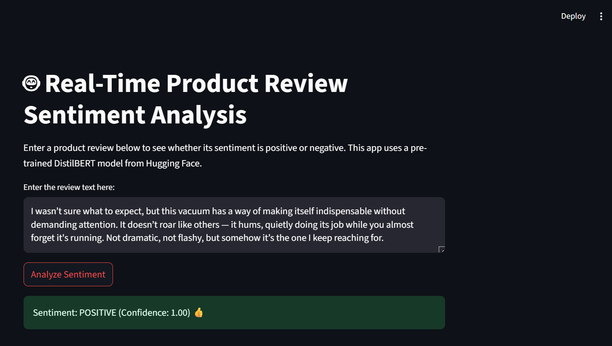

# Real-Time Product Review Sentiment Analysis App

 
*You can take a screenshot of your running Streamlit app and add it to your project folder with this name.*

## Description
This project is a web application that analyzes the sentiment of user-provided text in real-time. It uses a pre-trained DistilBERT model from the Hugging Face library to classify text as either POSITIVE or NEGATIVE. The entire application is built in Python and deployed using Streamlit.

## Live Demo
*Once you deploy your app to Streamlit Community Cloud, paste the link here.*
You can try the live application here: **[https://[YOUR-STREAMLIT-APP-URL].streamlit.app/](https://[YOUR-STREAMLIT-APP-URL].streamlit.app/)**

## Project Features
- Real-time sentiment prediction from user input.
- Clean, interactive user interface built with Streamlit.
- Leverages a state-of-the-art NLP model (DistilBERT) for high accuracy.

## Technologies Used
- **Programming Language:** Python
- **Data Science Libraries:** Pandas, NLTK
- **ML/DL Model:** Transformers (Hugging Face)
- **Deployment & Web App:** Streamlit

## How to Run Locally
To run this project on your own machine, follow these steps:

1. **Clone the repository:**
   ```bash
   git clone [https://github.com/](https://github.com/)csmax729/sentiment-analysis-project.git
   cd sentiment-analysis-project
   
2. **Create and activate a virtual environment:**
   '''bash
   python -m venv venv
   source venv/bin/activate  # On Windows use `venv\Scripts\activate`

